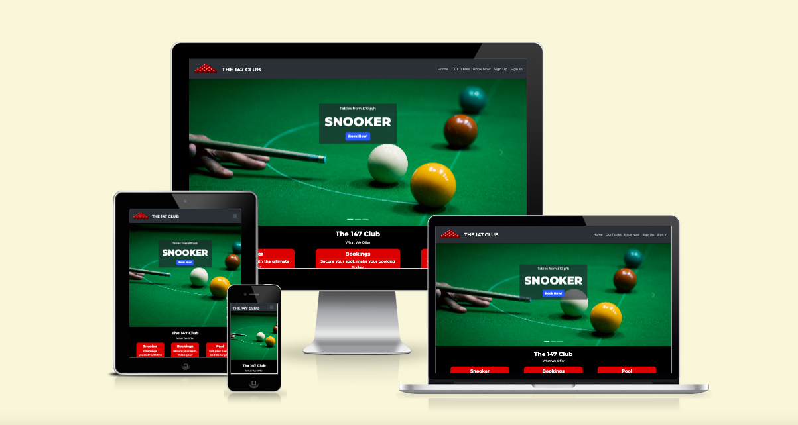
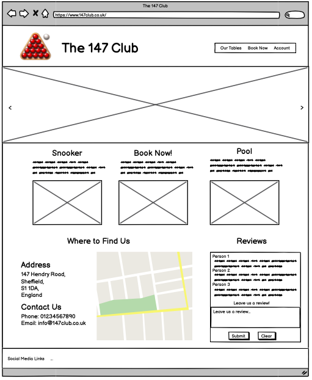
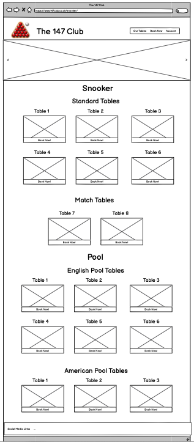
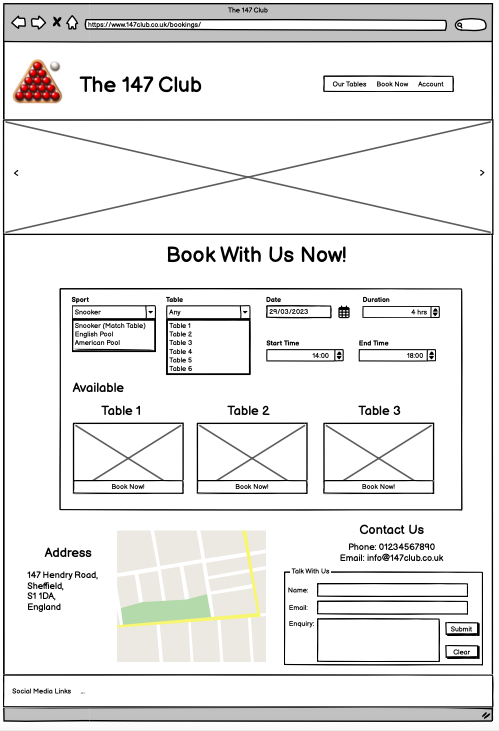
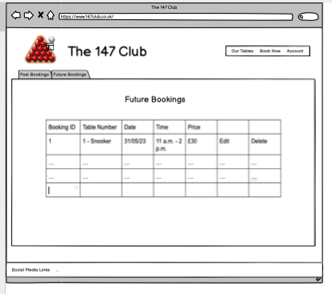
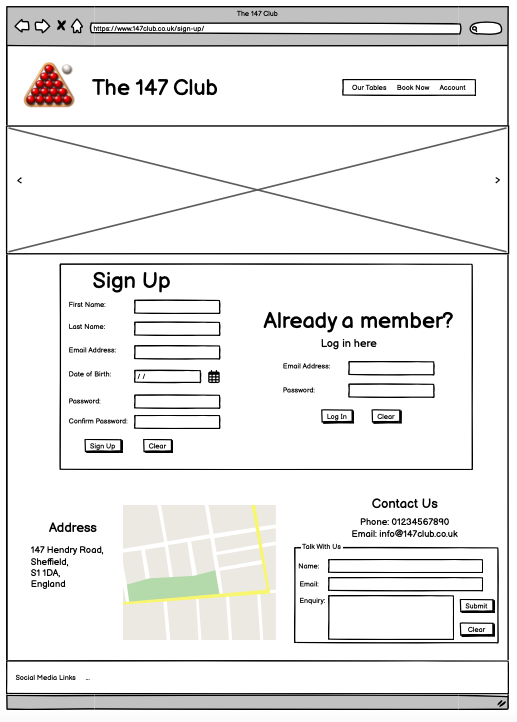
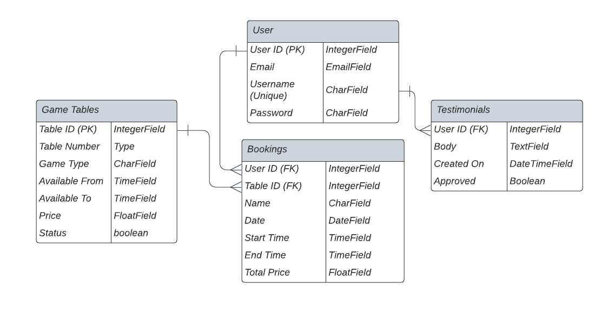

# **The 147 Club**

 
## **About**

This is a website for a Snooker hall built using Django. The aim of this site is for users to be able to create an account and be able to reserve a snooker or pool table for a given date and time in the future. 

 
This site features CRUD functionality so users can manage their bookings, as well as being able to edit and delete them if necessary. This allows the user to change their mind if they are no longer able to make their booking time without affecting the club's availability. Having this functionality helps both the user and the owners of the club, as it would help to reduce the amount of users not attending their slot as it can be easily updated.

 
The user is also able to submit testimonials regarding their time at the snooker club in which the admin has the ability to approve them for the home page.

 
 
## **Features**

### **Existing Features**

#### **Booking System**
- Create Booking 
- View Booking
- Update Booking
- Delete Booking

Users are able to create, read, update, and delete their bookings. Users must be logged in to use this functionality.

#### **Account System**
Users are able to create an account with Django's built-in account system (AllAuth). Having this functionality allows users to be able to view their specific bookings. It also allows the admin to ensure that they know who is coming in for a booking. 

#### **User Input Validation**
- **No double bookings** - A user is unable to book a table if it has already been booked from another user for the time and date they desire.
- **A user is unable to book two tables at once** - A user cannot book two different tables for the same date and time. This is to prevent large bookings and people accidentally booking more than once.
- **The submitted start time must be earlier than the end time** - This has to be the case as you can't have a booking with these form inputs
- **The selected start time can only be between 11:00:00 and 22:00:00** - This is to fit within the snooker hall's opening times. The reason it is restricted like this is so you can't have a start time that starts when the club is closing.
- **The selected end time can only be between 12:00:00 and 23:00:00** - This is to fit within the snooker hall's opening times. The reason it is restricted like this is so you can't have an end time for when the club is opening.
- **The booked date cannot be in the past** - This makes sure that the booking is for the future and not the past. 

If any of the above conditions are met. The user will be shown an error message corresponding to the given error. They will be asked to change the part that was causing the issue.

#### **Collapsable Navbar**
- The navbar is set to become collapsable when viewed on medium size screens and below. This is beneficial as when the viewport width is smaller the navbar becomes squashed. Having the navbar dropdown like this improves the UI and is intuitive to the user.

#### **Auto Scrolling Images**
- The home page contains an auto-scrolling carousel. The carousel contains images of the three cue sports available at the club. This immediately shows the user what the club has to offer. It also offers a 'Book Now!' button making it easy for the user to quickly get to the reservation form page. 

#### **Overflow Boxes**
- The testimonial section includes a scrolling overflow box. This means that the size of the testimonial section will still remain consistent despite the number of testimonials it contains. 

#### **Testimonials**
- Users have the ability to submit testimonials. 
- The admin has the ability to toggle an approved boolean so they can manage what testimonials are shown on the page. This could be to prevent bad language or accidentally submitted testimonials from being shown to the user.
- The Admin has the capability to delete any testimonials as they wish from the admin panel

#### **Google Maps API**
- The home page includes a Google Maps API to show the user the location of the club. This is useful to the user as they can see exactly where the club is and how to get there. It gives the user a more visual representation of the club's location. 

#### **Cloudinary**
- Cloudinary is used to store the images for the booking app. The Admin has a cloudinary field in the GameTable model where they can add an image to correspond with the table they are uploading. These images are easily updated or removed in the admin panel.

#### **Close tables for maintenance**
- The admin has the ability to give the tables in the GameTable model a status of 'Working' or 'Maintenance'. Doing this makes the table unable to be booked while the table has a status of 'Maintenance'. 

#### **Past and Future bookings**
- The 'My Bookings' page includes tabs for past and Future bookings. 
- The bookings are ordered by date. This makes it easy for a user to see the next booking they have and also keep track of their previous bookings.

 
### **Future Features**
These are some features that I would like to add in the future.

- **Implement email confirmation of a booking to the user** - Including email confirmation is common practice and makes the user feel more secure about their booking.
- **Send reminders to the user  1hr before their time slot** - Sending reminders to the user before their slot will help reduce users not attending their slot.
- **Payment or deposit** - Having an upfront payment or a deposit system will also help reduce users not attending their slot as they have already paid for it. Even if they do not attend the club will not miss out on payments and table time.
- **Suggest an alternative table if the user picks one that is unavailable** - Having this functionality will make it easier for a user to create a booking, especially during busy periods. 
- **Email verification to ensure the email entered exists** - Having email verification will ensure that the email entered is legit and corresponds to the user. This ensures that any future email confirmation will go to the correct place. 
- **log in with social media and Google accounts** - Logging in with social media or Google will make the signup process for the user very quick. 
- **Store user's first name and last name in built-in Django account system** - Storing the first and last name will mean that the user won't need to enter it when making a booking, it will be retrieved from the database. This will make the booking process shorter and easier for the user.
- **Store the user's date of birth** - Storing the user's date of birth will allow the club to restrict people of a young age from booking for late in the evening. Most clubs have restrictions regarding children being supervised at certain times.

 
## **Testing**

You can view my testing procedures in [TESTING.md](TESTING.md)

 
### **Bugs**
- After my 'Final commit', there were no static files showing up when <code>DEBUG = False</code> so I removed the WhiteNoise dependency and ran <code>python3 manage.py collectstatic</code> in the terminal. This solved the issue of no static files. The original purpose for Django WhiteNoise was to host its own static files for Heroku as it was not able to find the relevant static files.

#### **Remaining Bugs**
- The only known bug is when a user selects an end time out of the range of the business' opening times. The pop-up tells the user to choose a slot after 12:00 rather than saying before 23:00. I'm unsure how to change this message so I have decided to leave it because at the top of the page, the user is told the opening times.

 
## **Deployment**

Steps for deployment:
1. **Create a new app:** Sign in to Heroku, click on the "New" button in the dashboard, and select "Create new app". Give your app a unique name and choose the region closest to your intended audience.
2. **Connect your app to GitHub:** In the Heroku dashboard, navigate to the "Deploy" tab. Look for the section called "Deployment method" and choose GitHub as the option. This will allow you to connect your Heroku app to your GitHub repository.
3. **Configure the deployment settings:** Create a file called <code>Procfile</code> in the root directory. Inside the <code>Procfile</code>, add the following line: <code>web: gunicorn snookerhall.wsgi</code>
4. **Specify dependencies:** Use the following command to freeze the installed packages and generate a requirements.txt file: <code>pip freeze > requirements.txt</code>
5. In the Heroku dashboard, go to the "Settings" tab and click on "Reveal Config Vars". Add the following Config Vars:
    - CLOUDINARY_URL: [Value specific to your Cloudinary configuration]
    - DATABASE_URL: [Value specific to your database configuration]
    - DISABLE_COLLECTSTATIC: 1
    - HEROKU_POSTGRESQL_GREEN_URL: [Value specific to your Heroku Postgres configuration]
    - PORT: 8000
    - SECRET_KEY: [Value specific to your Django app's secret key]
    Make sure to replace the values in brackets [...] with the actual values required for your app.
6. With the configurations in place, navigate to the Heroku dashboard and go to the "Deploy" tab. You will find an option to deploy your app from a branch. Choose the main branch and click on "Deploy branch", you can also click on "Automatic Deploys" if you wish. 
 

You can find the live link here: [The 147 Club](https://snooker-hall-booking-system.herokuapp.com/)

## **Wireframes**
### **Home Page**

### **Tables Page:**

### **Booking Now Page:**

### **My Bookings Page:**

### **Signup Page:**

## **Entity Relationship Diagram**
The ER Diagram shows the structure of the databases used in this project.

## **Credits**

### **Images**
**Home Page**
- logo.png - https://pixabay.com/vectors/balls-cue-game-billiard-leisure-34909/
- american-pool.jpg - https://www.freepik.com/free-photos-vectors/snooker-table
- snooker-home.jpg - https://www.pexels.com/photo/close-up-photo-of-snooker-game-11354500/
- pool-home.jpeg - https://www.istockphoto.com/photo/pool-billiards-table-gm177512476-21482817
- Favicon Image - https://www.onlinelabels.com/clip-art/Red-snooker-ball-111122
https://www.onlinelabels.com/API/Clipart/DownloadClipart?ClipArtID=111122&FileExtension=png

**Tables Page**
- Snooker tables - https://www.express.co.uk/sport/othersport/1303320/snooker-clubs-reopen-can-snooker-clubs-open-on-July-4
- English Pool Tables - https://www.potblack.co.nz/blackball/
- American pool tables - https://www.tripadvisor.com/LocationPhotoDirectLink-g186530-d8561134-i365398390-The_Ball_Room_Sports_Bar_Pool_Hall_Dunfermline-Dunfermline_Fife_Scotland.html
