# Testing
## Contents

- [Validator Testing](#validator-testing)
    - [HTML](#html)
    - [CSS](#css)
    - [Javascript](#javascript)
    - [Python](#python)
- [WAVE Evaluation Tool](#wave-evaluation-tool)
- [Lighthouse Reports](#lighthouse)
- [Manual Testing](#manual-testing)
- [Automated Testing](#automated-testing)

## Validator Testing
### HTML
To validate my HTML code I used [W3C HTML validator](https://validator.w3.org/#validate_by_input) by direct input. I copied and pasted the source code from developer tools for each page and there were no errors returned.

#### Home

#### Our Tables

#### Book Now

#### My Bookings

#### Edit Booking

#### Delete Booking

#### Review

### CSS
To validate my CSS I used the [W3C CSS validator](https://jigsaw.w3.org/css-validator/#validate_by_input) by direct input. I copied and pasted my [style.css](static/css/style.css) file into the validator and it returned no errors.

### Javascript
To test my javascript code I ran my [scripts.js](static/js/scripts.js) file through [JSHint](https://jshint.com/). The following errors are out of my control:

These errors are in regards to the javascript from the embedded Google Maps on the home page. It is not recommended to edit this code therefore I have left it with these errors.

### Python
To validate my Python code I used autopep8 to format my .py files.
Firstly I installed the autopep8 formatter by using the following command <code>pip install autopep8</code>. After this I used to following command <code>autopep8 --in-place --aggressive --aggressive</code> followed by the filename to aggressively format each Python file in the booking app

To further validate my Python files against the pep8 guidelines I used pycodestyle to run a command that returns the first error in the file. To install pycodestyle I entered the following command into the terminal <code>pip install pycodestyle</code>The command to reveal the errors was: <code>pycodestyle --first </code> followed by the filename. I ran this command for each python file in the booking app and after the changes had been made there were no errors.

## WAVE Evaluation Tool
To test this site's accessibility I used the [WAVE Evaluation Tool](https://wave.webaim.org/) to find any errors on the site. 

After testing each page there were no errors returned, however there were a couple of alerts to note.

On the home page, the following alerts were found:

The first alert is in regard to the home page link. The WAVE tool says that it is redundant as there is another link to the home page just before it. I have decided to ignore this as it doesn't cause any issues and adheres to my design choices.

The other alerts are in regard to the embedded Google map at the bottom of the home page. I am unable to do anything about these alerts so I have left them.

After testing the other pages the only alert found on each page was in regards to the redundant home page link. Which I have chosen to keep for design reasons.

## Lighthouse
### **Home**

**Desktop**

Prior to home image compression:

After home image compression:

**Mobile**

Prior to home image compression:

After home image compression:

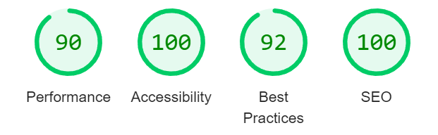

I believe that the some of the performance issues are due to the embedded Google Maps API.

The home images could also benefit from being resized.

### **Our Tables**
**Desktop**

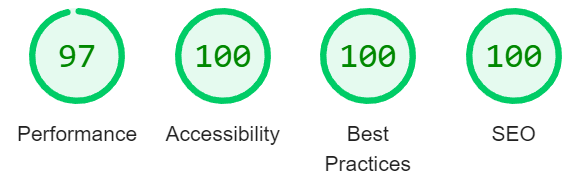

**Mobile**

### **Book Now**
**Desktop**

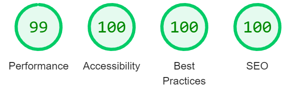

**Mobile**

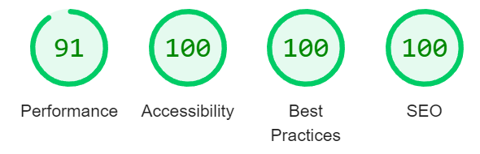

### **My Bookings**
**Desktop**

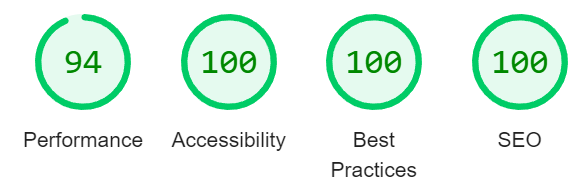

**Mobile**

### **Edit Booking**
**Desktop**

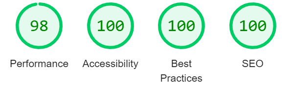

**Mobile**

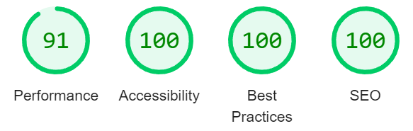

### **Delete Booking**
**Desktop**

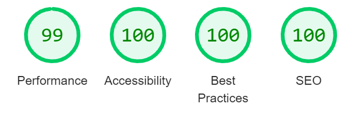

**Mobile**

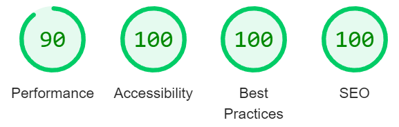

### **Review**
**Desktop**

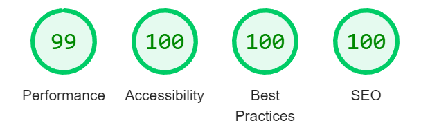

**Mobile**

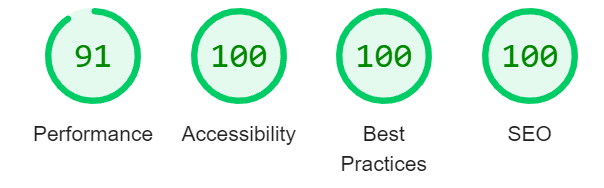

## Manual Testing
To test this site I created pass criteria for the following user stories.

I then put these pass criteria into a table and ticked it off as passed once I had checked each functionality worked as expected.

### USER STORY - Delete Bookings

| Passed | Pass Criteria |
|---|---|
| ✔ | A user can delete a booking |
| ✔ | Ensure a booking has been deleted |
| ✔ | A user can only do this if they are logged in |
| ✔ | A user cannot delete other user's bookings |

### USER STORY - Edit Bookings

| Passed | Pass Criteria |
|---|---|
| ✔ | A user can edit the information on their booking |
| ✔ | A user cannot edit a booking to overlap with another booking |
| ✔ | A user cannot edit a booking to overlap with one of their existing bookings |
| ✔ | A user can only edit a booking if they are logged in |
| ✔ | A user can only edit a booking if the booking was created with the account logged in  |

### USER STORY - View Tables

| Passed | Pass Criteria |
|---|---|
| ✔ | Users can view the tables on the tables page |

### USER STORY - View Feedback

| Passed | Pass Criteria |
|---|---|
| ✔ | Users can view testimonials on the home page |
| ✔ | The admin can view all feedback in the admin panel |

### USER STORY - Add New Pool/Snooker Tables

| Passed | Pass Criteria |
|---|---|
| ✔ | In the admin panel, the admin can add new tables |
| ✔ | The tables successfully submit and display on the tables page |

### USER STORY - Approve Feedback Comments

| Passed | Pass Criteria |
|---|---|
| ✔ | The admin can approve comments in the admin panel |
| ✔ | The approved testimonial now shows on the home page |

### USER STORY - Submit Feedback

| Passed | Pass Criteria |
|---|---|
| ✔ | A logged-in user can submit a testimonial |
| ✔ | A user can only submit a testimonial if they are logged in |
| ✔ | A user can only submit one testimonial |

### USER STORY - Create and Edit Bookings

| Passed | Pass Criteria |
|---|---|
| ✔ | A logged-in user can create a new booking |
| ✔ | The booking is unable to overlap with any existing booking on that table |
| ✔ | The booking is unable to overlap with a user's existing booking |
| ✔ | A user cannot access this page if they are not logged in |
| ✔ | A user can edit a booking |
| ✔ | A user cannot edit a booking that overlaps with an existing booking on the chosen table |
| ✔ | A user cannot edit a booking that overlaps with their own existing booking regardless of table number |

### USER STORY - View All Bookings (Admin)

| Passed | Pass Criteria |
|---|---|
| ✔ | The admin is able to view all bookings in the admin panel |

### USER STORY - Block Tables for Maintenance

| Passed | Pass Criteria |
|---|---|
| ✔ | The admin is able to change the table's status to "in maintenance" via the admin panel |
| ✔ | The user is unable to book a table that is "in maintenance" |

### USER STORY - Select Date and Time

| Passed | Pass Criteria |
|---|---|
| ✔ | The user is able to select a date and time they would like to play |
| ✔ | The user cannot select a date in the past |
| ✔ | The user cannot select a start time that is after the end time |
| ✔ | The user cannot select a time that is out of the opening hours |
| ✔ | The user cannot select a time that this before the current time on today's date |

### USER STORY - Select Table

| Passed | Pass Criteria |
|---|---|
| ✔ | A user can select the table they want |
| ✔ | The same table cannot be booked more than once at a time |

### USER STORY - View Bookings

| Passed | Pass Criteria |
|---|---|
| ✔ | A user can view their bookings |
| ✔ | The user can view their past bookings |

### USER STORY - Log In and Out

| Passed | Pass Criteria |
|---|---|
| ✔ | A user is able to log in to their account |
| ✔ | A user is able to log out of their account |
| ✔ | When a user logs in they are redirected to the home page |

### USER STORY - Create an Account

| Passed | Pass Criteria |
|---|---|
| ✔ | A user is able to create an account |

## Automated Testing

To further test this site I created some unit tests that test different things across the website. These test files all contain docstrings explaining the purpose of each test.

You can view the test files here:
- [test_forms.py](booking/test_forms.py)
- [test_models.py](booking/test_models.py)
- [test_urls.py](booking/test_urls.py)
- [test_views.py](booking/test_views.py)

To run these tests you need to enter <code>python3 manage.py test</code> into the terminal and press enter. As you can see below all tests passed with no issues.

